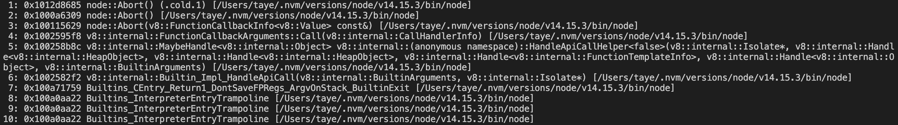

# Process

## Process对象

## Process events

'beforeExit'

'disconnect'

'exit'

'message'

'multipleResolves'

'uncaughtException'

'uncaughtExceptionMonitor'

'unhandleRejection'

'warning'

'worker'

## process method

### process.abort()

使当前process立即退出并生成一个核心文件

### process.cpuUsage()

### process.cwd()

nodejs的current working directory

### process.disconnect()

### process.allowedNodeEnvironmentFlags

读取允许的环境变量标识

### process.arch

return: <string>

编译nodejs二进制文件的操作系统CPU架构，可能是`'arm'`，`'arm64'`，`'ia32'`，`'mips'`，`'mipsel'`，`'ppc64'`，`'s390'`，`'s390s'`，`'x32'`，`'x64'`

### process.argv

return: <string[]>

返回nodejs进程启动时命令行的参数

第一个是node地址，第二个是被执行文件地址，后面是后续参数

### process.config

config

### process.connected

connected

### process.debugPort

当nodejs debugger开启时使用的端口

### process.channel

TODO